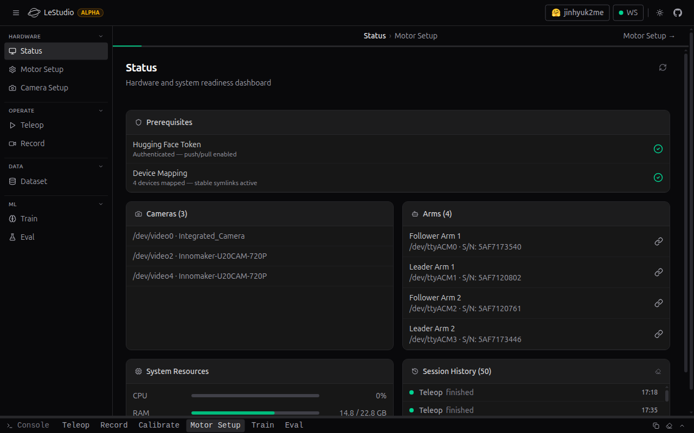
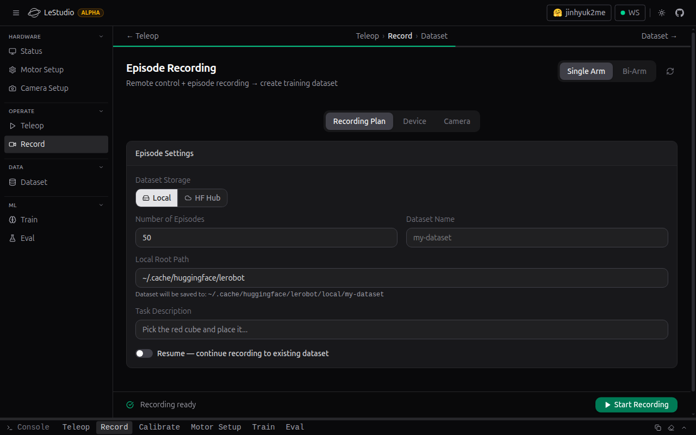
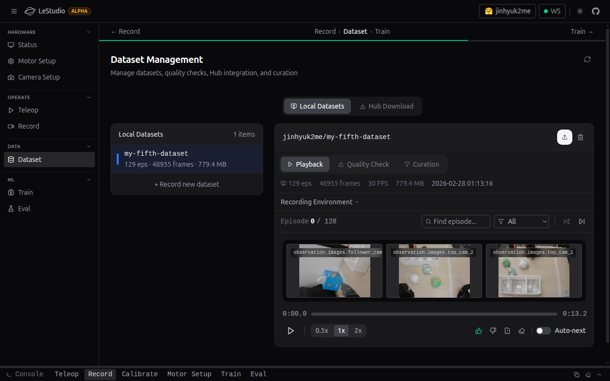
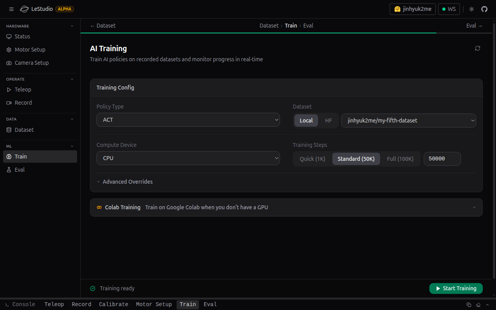

# LeStudio

[](https://github.com/TheMomentLab/lestudio/actions/workflows/ci.yml)
[](https://themomentlab.github.io/lestudio/)
[](LICENSE)
[](https://www.python.org/)

[Hugging Face LeRobot](https://github.com/huggingface/lerobot)을 위한 웹 기반 GUI 워크벤치 — 하드웨어 설정부터 정책 평가까지 전체 파이프라인을 지원합니다. CLI 중심의 LeRobot 워크플로우를 브라우저 인터페이스로 대체합니다.

**[문서](https://themomentlab.github.io/lestudio/)** · **[기여 가이드](CONTRIBUTING.md)** · **[변경 이력](CHANGELOG.md)** · **[English](README.md)**

내부 구조 문서:

- [내부 문서 맵](docs/README.md)
- [현재 아키텍처](docs/current-architecture.md)
- [API 및 스트리밍](docs/api-and-streaming.md)

## 스크린샷

| 상태 | 녹화 |
|---|---|
|  |  |

| 데이터셋 | 학습 |
|---|---|
|  |  |

## 기능

### 워크벤치 및 런타임 기반
- **워크벤치 레이아웃**: 하드웨어 설정부터 학습/평가까지 이어지는 사이드바 중심 워크플로우.
- **전역 콘솔 서랍**: stdout/stderr 통합 스트림, 프로세스 입력 라우팅, 로그 복사 액션 제공.
- **반응형 내비게이션**: 데스크톱 사이드바, 태블릿 아이콘 레일, 모바일 서랍 레이아웃.
- **설정 프로필**: 작업 설정 저장, 불러오기, 가져오기, 내보내기, 삭제.
- **세션 히스토리**: 녹화, 학습, 평가 흐름의 실행 이벤트 추적.

### 하드웨어 설정 및 검증
- **상태 대시보드**: CPU/RAM/Disk/GPU와 함께 장치 및 프로세스 상태를 실시간으로 표시.
- **카메라 미리보기**: UI에서 MJPEG 및 snapshot 기반 카메라 미리보기 제공.
- **장치 매핑**: 카메라/팔 udev 규칙 관리와 Arm Identify Wizard 제공.
- **USB 대역폭 모니터링**: 카메라별 FPS, 대역폭, 버스 사용률 피드백 제공.
- **모터 설정**: `lerobot_setup_motors` 기반 모터 연결 및 설정.
- **캘리브레이션**: 캘리브레이션 실행, 파일 관리, 삭제.
- **사전 점검**: 실행 전 장치, 캘리브레이션, 카메라, CUDA 상태 검증.

### 조작: 텔레옵 및 녹화
- **텔레옵**: 멀티카메라 원격 조작, 사전 점검, SHM 기반 실시간 카메라 피드 유지.
- **녹화**: 브라우저 기반 에피소드 제어, resume 지원, 사전 점검을 포함한 녹화 흐름.

### 데이터셋 및 Hub
- **데이터셋**: 로컬 데이터셋 조회, 상세, 삭제, 품질 검사.
- **에피소드 리플레이어**: 멀티카메라 동기화 재생, 타임라인 스크러빙.
- **에피소드 큐레이션**: 에피소드별 삭제, 태그, 필터.
- **Hub 검색 및 다운로드**: Hugging Face Hub에서 데이터셋 검색 및 다운로드.
- **Hub 업로드**: 진행 상태 추적과 함께 로컬 데이터셋 업로드.

### 학습 및 평가
- **학습**: CUDA 사전 점검, 실시간 loss/LR 차트, ETA 추적, 하이퍼파라미터 프리셋을 포함한 LeRobot 학습 실행.
- **의존성 복구**: PyTorch 및 관련 학습 의존성에 대한 안내형 설치 흐름.
- **체크포인트 브라우저**: 로컬 체크포인트 스캔 및 Eval 자동 연결.
- **평가**: 정책 평가 실행, 실시간 프로세스 출력, 에피소드별 결과 추적.

### 모니터링 및 운영자 피드백
- **런타임 상태**: WebSocket 기반 상태 공유, 프로세스 중지 제어, orphan-process 복구 신호.
- **시스템 모니터링**: UI에서 GPU 및 시스템 리소스 가시성 제공.
- **오류 번역**: 일반적인 raw 프로세스 오류를 운영자 친화적 안내로 변환.
- **데스크톱 알림**: 프로세스 완료 또는 오류 시 브라우저 알림.
- **다크/라이트 테마**: CSS 변수 기반 테마 전환.

## 요구 사항

- Python 3.10+
- Linux (`udev` 규칙 및 `/dev/video*` 접근에 필요)
- `huggingface/lerobot`이 환경에 설치되어 있어야 함

### 선택 사항

- **udev 적용**: 패스워드 없는 `sudo` 또는 데스크톱 Polkit 인증 프롬프트(`pkexec`)가 있으면 원클릭으로 설치. SSH/헤드리스 환경에서는 LeStudio가 수동 명령을 제공.
- **Hub push / download**: `huggingface-cli login` 및 유효한 토큰 필요.
- **GPU 모니터링 / CUDA preflight**: 전체 Train 진단을 위해 CUDA 환경 및 `nvidia-smi` 필요.

## 설치

소스에서 설치:

```bash
git clone --recursive https://github.com/TheMomentLab/lestudio.git
cd lestudio
# 최초 1회 (필요 시): conda create -n lerobot python=3.10 -y
conda activate lerobot
make install
```

[커스텀 lerobot 포크](https://github.com/TheMomentLab/lerobot)는 git 서브모듈로 관리됩니다. `--recursive`로 자동으로 가져오며, `make install`이 두 패키지를 편집 가능 모드로 설치합니다.

## 실행

```bash
lestudio
```

서버는 `http://localhost:7860`에서 시작됩니다.

데스크톱 세션에서 브라우저를 자동으로 열려면 `--browser`를 사용하세요 (`lestudio --browser` 또는 `lestudio serve --browser`). SSH 또는 헤드리스 환경에서는 브라우저를 열지 않습니다.

### 커맨드라인 옵션

```
usage: lestudio [-h] {serve,install-udev} ...

서브커맨드:
  serve           LeStudio 웹 서버 시작 (서브커맨드 없이 실행 시 기본값)
  install-udev    sudo를 통해 udev 규칙 설치 (웹 UI 대신 CLI로 적용)

lestudio serve:
  --port PORT           서버 포트 (기본값: 7860)
  --host HOST           서버 호스트 (기본값: 127.0.0.1)
  --lerobot-path PATH   lerobot 소스 경로 (설치되어 있으면 자동 감지)
  --config-dir DIR      설정 디렉토리 (기본값: ~/.config/lestudio)
  --rules-path PATH     udev 규칙 파일 (기본값: /etc/udev/rules.d/99-lerobot.rules)
  --browser             시작 시 브라우저 자동 열기
  --no-browser          호환성 유지용 옵션(no-op); --browser를 주지 않으면 기본적으로 브라우저를 열지 않음
  --headless            --no-browser의 별칭
```

`serve`를 명시하지 않고도 플래그를 전달할 수 있습니다 — `lestudio --port 8080`은 `lestudio serve --port 8080`과 동일합니다.

### 네트워크 & CORS

- 기본 바인딩은 로컬 전용: `127.0.0.1`.
- LAN에 노출하려면: `lestudio serve --host 0.0.0.0`.
- 다른 장치에서 UI에 접속하면, 헤더의 `Remote` 배지에서 LeStudio 세션 토큰을 저장할 수 있습니다. 저장된 토큰이 없으면 첫 상태 변경 작업 시 브라우저 prompt가 fallback으로 한 번 뜹니다.
- 기본 CORS는 localhost 출처만 허용 (`localhost` / `127.0.0.1`).

환경 변수로 CORS를 재정의할 수 있습니다:

```bash
# 쉼표로 구분된 명시적 허용 목록
export LESTUDIO_CORS_ORIGINS="http://localhost:7860,https://studio.example.com"

# 선택적 정규식 재정의 (명시적 출처가 설정되지 않은 경우 사용)
export LESTUDIO_CORS_ORIGIN_REGEX='^https://(localhost|127\.0\.0\.1)(:\d+)?$'
```

개발 호환성을 위해 `LESTUDIO_CORS_ORIGINS="*"`도 지원되지만, 공유 네트워크에서는 권장하지 않습니다.

## 개발

```bash
conda activate lerobot
```

기여용 검증 명령(`ruff`, `mypy`, pytest coverage helper)을 쓰려면 dev extras를 한 번 설치하세요:

```bash
make dev
```

백엔드 (파일 변경 시 자동 리로드):

```bash
lestudio serve --reload
```

백엔드 검사:

```bash
python -m ruff check src/lestudio
python -m mypy src/lestudio --ignore-missing-imports
python -m compileall -q src/lestudio
make test
```

`make test`는 pytest 범위를 `tests/`로 고정하고 `PYTEST_DISABLE_PLUGIN_AUTOLOAD=1`를 설정해, 주변 ROS/데스크톱 플러그인 영향으로 검증이 깨지는 상황을 피합니다. 백엔드 CI도 merge 전에 같은 `ruff`/`mypy`/`compileall`/pytest 순서를 실행합니다.

프론트엔드 검사:

```bash
cd frontend
npm ci
npm run lint
npm test -- --run
npm run test:e2e
npm run build
```

`npm run build`는 프론트엔드 번들을 `src/lestudio/static/`에 출력하며, FastAPI가 이 결과물을 직접 서빙합니다.

CI는 모든 push 시 이 검사를 자동으로 실행합니다: `.github/workflows/ci.yml`.

아키텍처 개요, PR 가이드라인, LeRobot import 경계 규칙은 [CONTRIBUTING.md](CONTRIBUTING.md)를 참조하세요.

하드웨어 스모크 테스트 (실제 장치 필요, 선택적):

```bash
make test-hw
```

PR에서 사용자에게 보이는 기능이나 상위 소개 문서를 바꾸면 `docs/feature-spec.md`, `README.md`, `README.ko.md`를 같은 변경에서 함께 갱신하세요.

## 워크플로우 가이드

1. **Status** — 카메라와 팔이 감지되고 프로세스 상태가 정상인지 확인.
2. **Motor Setup** — 장치 매핑(udev 규칙), 팔 식별, 모터 설정, 캘리브레이션 실행.
3. **Camera Setup** — 카메라 스트림 및 USB 대역폭 확인.
4. **Teleop** — preflight 점검으로 동작 및 카메라 피드 검증.
5. **Record** — 목표 작업에 대한 에피소드 녹화.
6. **Dataset** — 에피소드 검토, 데이터 큐레이션, Hugging Face Hub push.
7. **Train** — 학습 시작 및 실시간 loss/메트릭 모니터링.
8. **Eval** — 정책 평가 실행으로 루프 완성.

## 라이선스

Apache 2.0 — [LICENSE](LICENSE) 참조.
